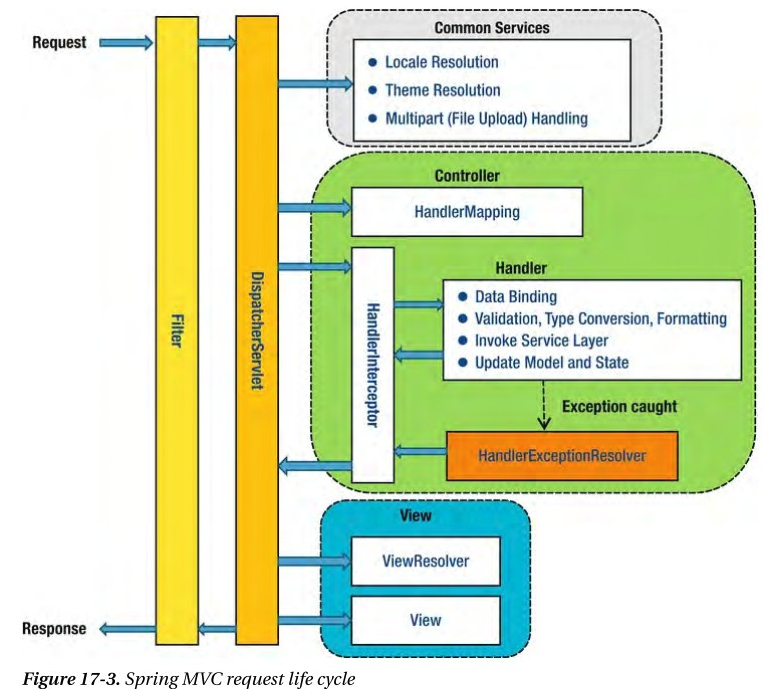
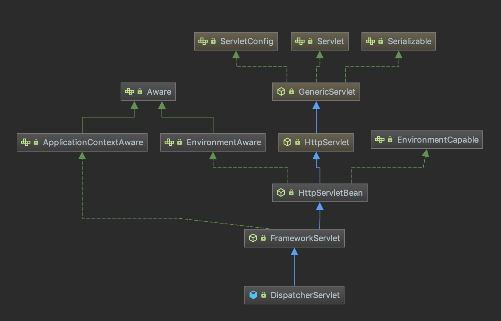
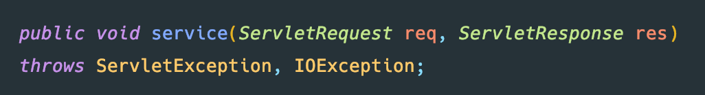
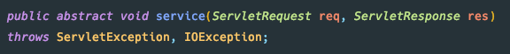
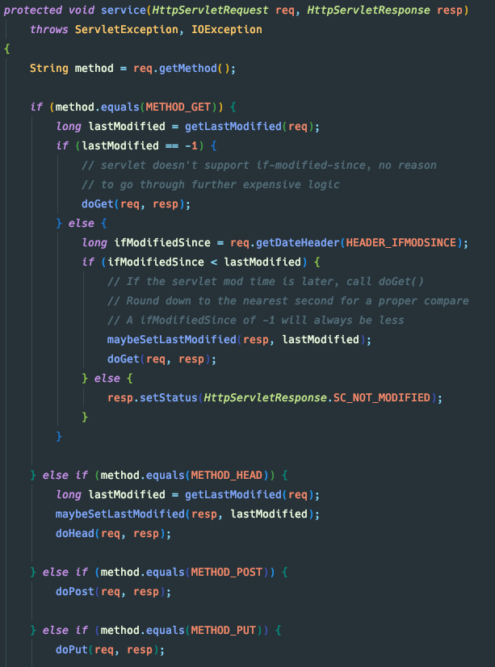
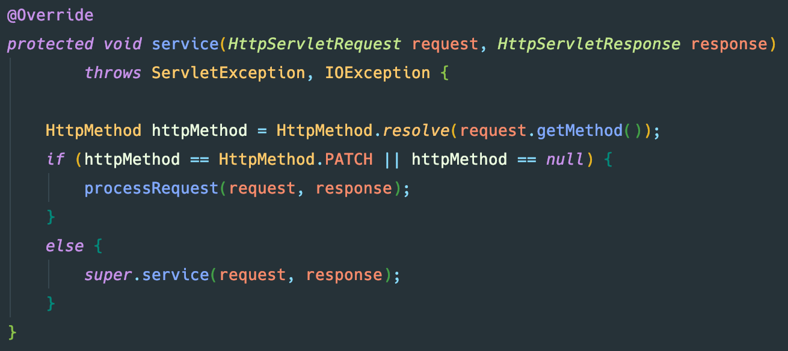
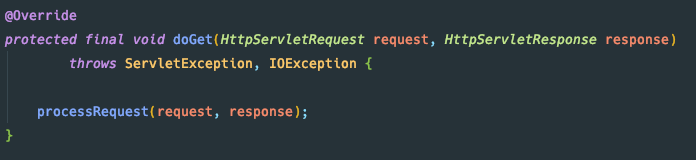
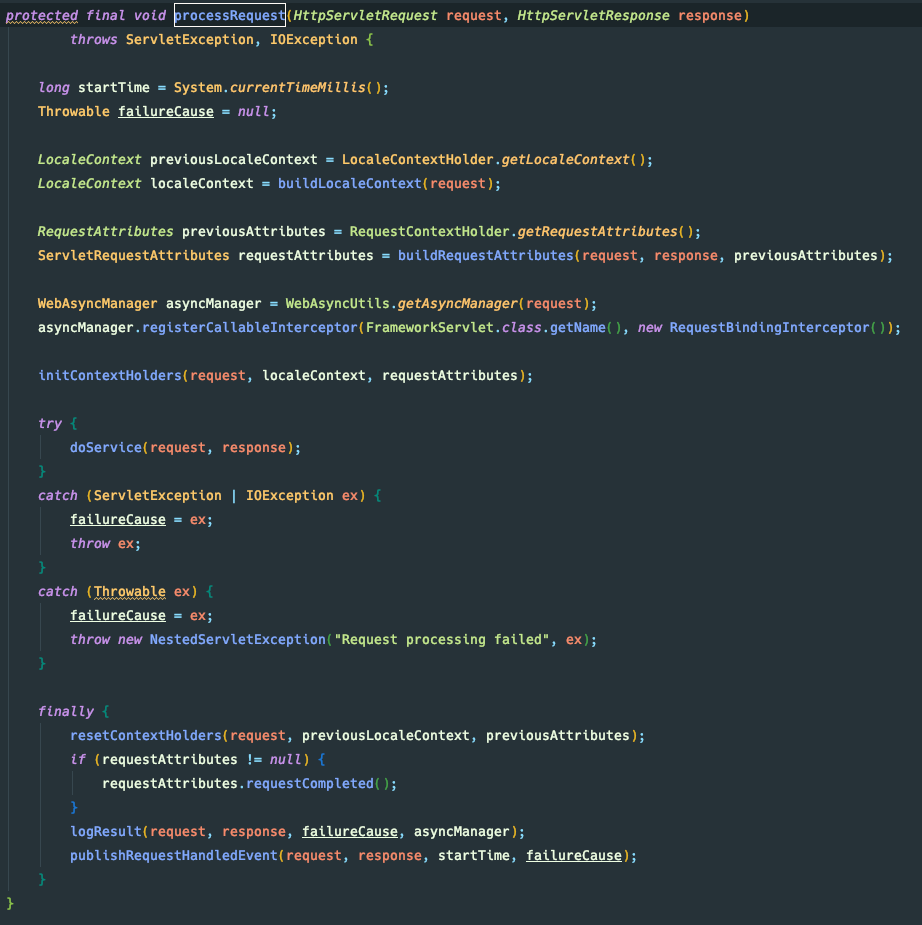
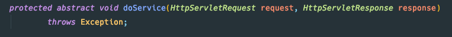

각각의 역할

## 들어가며
> SpringMVC에서 Request가 들어오면 어떠한 과정을 거치는지 정리하기 위해 작성합니다.

- 아래는 들어가기 전 참고하면 좋은 글입니다.
    - [SpringMVC 시작 - woniper님](https://blog.woniper.net/366)

## DispatcherServlet 구조

## Servlet#service

- WAS(Tomcat)은 Servlet의 service를 실행하게 됩니다.

## GenericServlet#service

- 실제 구현체인 HttpServlet을 봐야 이해가 가능합니다.

## HttpServlet#service

- HTTP Method에 맞는 do{HttpMethod} 함수를 호출하게 됩니다.

#### HttpServlet은 abstract Method가 없는데 왜 Abstract Class일까?
- [Link](https://stackoverflow.com/questions/18909206/why-httpservlet-is-an-abstract-class-any-functional-reason)
- HttpServlet class 자체를 생성하지 못하기 위해서 Abstract Class로 정의해 놓은거 같습니다.
- 왜 생성하지 못하게 막아놨을까?
    - API/Interface는 정의되어있지만, 실제 기능적으로는 완벽하지 않는 Servlet이기 때문입니다.

## FrameworkServlet#service

## FrameworkServlet#doGet

## FrameworkServlet#processRequest

- Locale 결정
- RequestContextHandler에 요청 저장
    - 일반 빈에서 HttpServletRequest, HttpServletResponse, HttpSession 등을 사용할 수 있도록 한다.
    - 해당 객체를 일반 빈에서 사용하게 되면, Web에 종속적이 될 수 있다.

## FrameworkServlet#doService

## DispatcherServlet#doService
- 요청 선처리 작업
- HadnlerExecutionChaine 결정

## DispatcherServlet#doDispatcher

## Reference
- <https://justforchangesake.wordpress.com/2014/05/07/spring-mvc-request-life-cycle/>
- <https://blog.woniper.net/369>